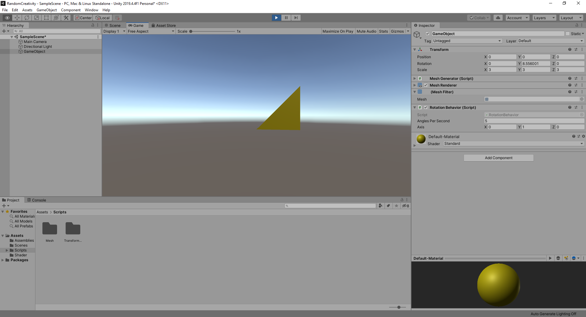
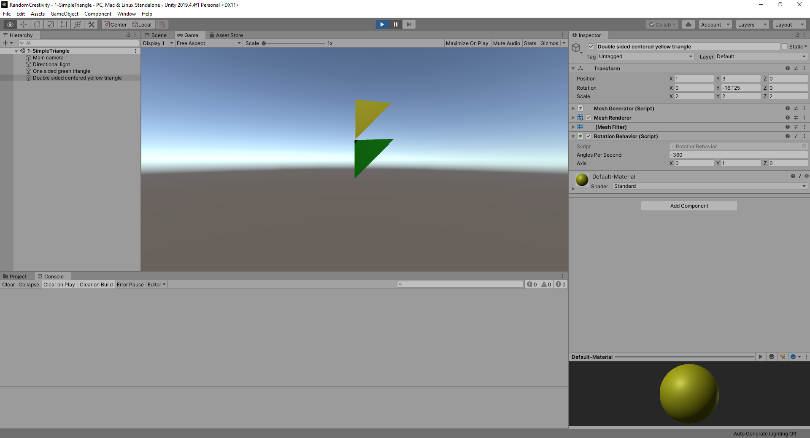

Random Creativity
=================

Is it possible to create truly creative, suprising procedural content? Or will the end result always be a predictable product of the list of the parameters of procedural heuristic? This project is a modest investigation of this question. 

The intention is to have some basic maze generation code in place and try to expand with variations around this concept. What happens if the shape of the maze gets varied? The colors? Does this result in  interesting mazes or more just more randomizations without soul?


First steps (23-24 July 2020)
------------------------------
However the first topic is simply drawing a grid. More specifically can we vary the shape of the grid tiles in a meaningful way like in [renowned explorers](https://www.renownedexplorers.com/) or [Townscaper](https://store.steampowered.com/app/1291340/Townscaper), or [this science paper](http://peterwonka.net/Publications/pdfs/2014.TOG.Chihan.QuadExploration.final.pdf), and [a nice demo](https://twitter.com/osksta/status/1147881669350891521?lang=en).

Even smaller for the first step we'll just draw a simple mesh at runtime in Unity. 

To create and draw a mesh at runtime in Unity one has to:

* create an empty GameObject
* add a MeshFilter 
* add MeshRenderer 
* implement a Mesh generation object

To make sure the mesh is indeed as expected, a rotation behavior is added to make the object rotate every second.

To define a mesh, a `MeshDefinition` class is added which simply looks like this:

```csharp
[Serializable]
public class MeshDefinition
{
    public Vector3[] vertices;
    public Vector2[] uv;
    public int[] triangles;

    public bool IsValid() => vertices.Length >= 3 && triangles.Length >= 3 && uv.Length >= 3;
}
```


Although subject to change, the code the core of the mesh generation is following call in `MeshGenerator`:

```csharp
private void UpdateMeshDefinition(Mesh mesh, MeshDefinition definition)
{
    mesh.vertices = definition.vertices;
    mesh.uv = definition.uv;
    mesh.triangles = definition.triangles;

    mesh.RecalculateNormals();
    mesh.RecalculateBounds();
    mesh.RecalculateTangents();
}
```

The results should show up as below:

<center>
    
</center>

### Scope Creep (next step considerations)

There are a couple of shortcomings with this approach, which could be added:

* No editor interactivity, you can't see the mesh as you're changing it in the editor
* The center of the mesh is defined by the definition. I'm not sure if that's ok or if an anchor point should be defined... I'm inclined to say the former, ie it's up to the user to fix the input data, BUT it would be nice and more user friendly if this was adjusted for the user. For now there's no intention to address this.
* Meshes are not doublesided. Same arguments as in the previous point apply.

Updating the Editor (24-25 July 2020)
----------------------------------

To get the editor to show and update the mesh as the user is editing the mesh is a matter of following the editor's wishes. It might not always be intuitive but luckily [stackoverflow](https://www.stackoverflow.com) and [unity's own forums](https://forum.unity.com/) generally provide the majority of the answers. 

Anyway, these are key points:

* Implement public void OnValidate() which receives a callback whenever the user changes a value in the editor.
* Note that there are limitations to what is possible in OnValidate (and Awake for that matter) and the editor may put up som  warnings (as per [this](https://forum.unity.com/threads/sendmessage-cannot-be-called-during-awake-checkconsistency-or-onvalidate.428580/) thread). The Editor can't guarantee 
* Note that there are limitations to what is possible in OnValidate (and Awake or  for that matter) and the editor may put up som  warnings (as per [this](https://forum.unity.com/threads/sendmessage-cannot-be-called-during-awake-checkconsistency-or-onvalidate.428580/) thread). The Editor _"can not guarantee to have a valid, fully initialized object"_. 
* To sidestep these, one can add a delayed callback (see the example below) to execute operations which modify the gamwe object.
* To modify the mesh in the MeshFilter component when in the editor, refer to the "sharedmesh" and not the "mesh" object. This is required because _"In the case of MeshFilter (and SkinnedMeshRenderer), calling mesh will cause an instance to be created if it hasn't already done so, allowing you to modify the mesh without manipulating all the other instances."_ ([thread](https://answers.unity.com/questions/63313/difference-between-sharedmesh-and-mesh.html)) .
* A pragma has to be put around delayed call (specifically the `EditorApplication.delayCall`) otherwise production builds will fail as there's not editor present. 
* IF the build target is webgl, one may need to [turn off compression](https://forum.unity.com/threads/solved-unity-2020-webgl-doesnt-work-uncaught-syntaxerror-invalid-or-unexpected-token.872581/), depending on whether or not this has been fixed by now...  

While it's understandable that there's a certain amount of exposure of the underlying implementation details to the user code, the end results feels quite clunky as it adds additional code to the implementation to deal with these implementation details. A post-validate callback could potentially have avoided this overhead. 

In any case the end result should show up as shown below. 

<center>
    
</center>
    
The code at this stage will look like:

<details>
  <summary> click to expand code </summary>
  
  ```csharp
using UnityEngine;
using UnityEditor;

using gg.core.util;

/// <summary>
/// Generates a mesh based off a MeshDefinition, Color and Material
/// </summary>
public class MeshGenerator : MonoBehaviour
{
    /// <summary>
    /// Contains all spatial properties of a mesh (and uvs)
    /// </summary>
    public MeshDefinition _meshDefinition;

    /// <summary>
    /// Material applied to the generated mesh
    /// </summary>
    public Material _meshMaterial;

    /// <summary>
    /// Color applied to the mesh
    /// </summary>
    public Color _meshColor = Color.yellow;

    /// <summary>
    /// Resolved or generated mesh filter
    /// </summary>
    private MeshFilter _meshFilter;

    /// <summary>
    /// Resolved or generated mesh renderer
    /// </summary>
    private MeshRenderer _meshRenderer;

    /// <summary>
    /// Tries to generate a mesh when awoken
    /// </summary>
    public void Awake()
    {
        // Need a delay call because of Unity-implementation reasons 
#if UNITY_EDITOR
        EditorApplication.delayCall += () =>
#endif
        {

            // if the user defined a mesh, update or create it 
            if (_meshDefinition != null && _meshDefinition.IsValid())
            {
                CreateMesh();
            }
        };
    }

    /// <summary>
    /// Create a mesh and all the dependencies (ie components needed to display the mesh)
    /// </summary>
    public void CreateMesh()
    {
        // check dependencies, create them if necessary
        _meshFilter = GetComponent<MeshFilter>();
        _meshRenderer = GetComponent<MeshRenderer>();

        if (_meshRenderer == null)
        {
            _meshRenderer = gameObject.AddComponent<MeshRenderer>();
        }

        if (_meshFilter == null)
        {
            _meshFilter = gameObject.AddComponent<MeshFilter>();
        }

        if (_meshMaterial != null)
        {
            var polyMaterial = new Material(_meshMaterial);
            polyMaterial.color = _meshColor;

            // check if in editor mode or in game mode, we need different materials (and meshes) otherwise we get warnings
            // from the editor
            if (Application.isPlaying)
            {
                _meshRenderer.material = polyMaterial;
            }
            else
            {
                _meshRenderer.sharedMaterial = polyMaterial;
            }
        }

        var mesh = new Mesh();
        
        if (Application.isPlaying)
        {     
            _meshFilter.mesh = mesh;
        }
        else
        {
            _meshFilter.sharedMesh = mesh;
        }

        UpdateMeshDefinition(mesh, _meshDefinition);
    }

    /// <summary>
    /// Called if a new mesh definition is available
    /// </summary>
    public void UpdateMesh()
    {
        Contract.Requires(_meshFilter != null && _meshRenderer != null);

        var mesh = Application.isPlaying ? _meshFilter.mesh : _meshFilter.sharedMesh;
    
        mesh.Clear();

        // check if in editor mode or in game mode, we need to assign different materials and meshes otherwise we get warnings
        // from the editor
        if (Application.isPlaying)
        {
            UpdateMaterial(_meshRenderer, _meshMaterial, _meshColor);
        }
        else
        {
           UpdateSharedMaterial(_meshRenderer, _meshMaterial, _meshColor);
        }

        UpdateMeshDefinition(mesh, _meshDefinition);
    }

    /// <summary>
    /// Callback from the editor something has changed
    /// </summary>
    public void OnValidate()
    {
        // Need a delay call because of Unity-implementation reasons 
#if UNITY_EDITOR
        EditorApplication.delayCall += () =>
#endif
        {
            // if the user defined a mesh, update or create it 
            if (_meshDefinition != null && _meshDefinition.IsValid())
            {
                if (_meshFilter == null || _meshRenderer == null)
                {
                    CreateMesh();
                }
                else
                {
                    UpdateMesh();
                }
            }
        };
    }

    private void UpdateMaterial(MeshRenderer meshRenderer, Material meshMaterial, Color meshColor)
    {
        // is mesh material different from the current material and is it defined? 
        if (meshRenderer.material != meshMaterial && meshMaterial != null)
        {
            var polyMaterial = new Material(meshMaterial);
            polyMaterial.color = meshColor;
            meshRenderer.material = polyMaterial;
        }
        // material defined and mesh material is different
        else if (meshRenderer.material != meshMaterial && meshMaterial == null)
        {
            meshRenderer.material = null;
        }
        else if (meshRenderer.material == meshMaterial && meshMaterial != null)
        {
            meshRenderer.material.color = meshColor;
        }
    }

    private void UpdateSharedMaterial(MeshRenderer meshRenderer, Material meshMaterial, Color meshColor)
    {
        // is mesh material different from the current material and is it defined? 
        if (meshRenderer.sharedMaterial != meshMaterial && meshMaterial != null)
        {
            var polyMaterial = new Material(meshMaterial);
            polyMaterial.color = meshColor;
            meshRenderer.sharedMaterial = polyMaterial;
        }
        // material defined and mesh material is different
        else if (meshRenderer.sharedMaterial != meshMaterial && meshMaterial == null)
        {
            meshRenderer.sharedMaterial = null;
        }
        else if (meshRenderer.sharedMaterial == meshMaterial && meshMaterial != null)
        {
            meshRenderer.sharedMaterial.color = meshColor;
        }
    }

    /// <summary>
    /// Set all the properties (verts, uvs, tris) of the mesh and recalculate all relevant settings (normals, bounds, tangents)
    /// </summary>
    /// <param name="mesh"></param>
    /// <param name="definition"></param>
    private void UpdateMeshDefinition(Mesh mesh, MeshDefinition definition)
    {
        mesh.vertices = definition._vertices;
        mesh.uv = definition._uv;
        mesh.triangles = definition._triangles;

        mesh.RecalculateNormals();
        mesh.RecalculateBounds();
        mesh.RecalculateTangents();
    }
}
```
 </details>

### Scope Creep (next step considerations)

All the issues raised in the previous section have been addressed by adjusting the data and the editor updates as intended. However there is a nagging error when building the application relating to the MeshGenerator being destroyed while accessing it. It's not immediately clear why this happens but doesn't get in the way.

Next the goal is to create a larger mesh with more triangles...

### Future references

Marking meshes as dynamic ... https://docs.unity3d.com/ScriptReference/Mesh.MarkDynamic.html