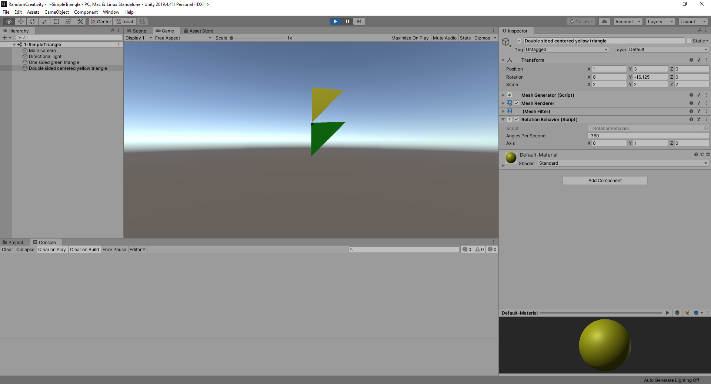

Updating the Editor 
=====================================

### [[Demo](Html/TwoTriangles/index.html)] [[Top](../readme.md)] [[Previous](001-first-steps.md)][[Next](003-mesh-sheets.md)]

To get the editor to show and update the mesh as the user is editing the mesh is a matter of following the editor's wishes. It might not always be intuitive but luckily [stackoverflow](https://www.stackoverflow.com) and [unity's own forums](https://forum.unity.com/) generally provide the majority of the answers. 

Anyway, these are key points:

* Implement public void OnValidate() which receives a callback whenever the user changes a value in the editor.
* Note that there are limitations to what is possible in OnValidate (and Awake for that matter) and the editor may put up som  warnings (as per [this](https://forum.unity.com/threads/sendmessage-cannot-be-called-during-awake-checkconsistency-or-onvalidate.428580/) thread). The Editor can't guarantee 
* Note that there are limitations to what is possible in OnValidate (and Awake or  for that matter) and the editor may put up som  warnings (as per [this](https://forum.unity.com/threads/sendmessage-cannot-be-called-during-awake-checkconsistency-or-onvalidate.428580/) thread). The Editor _"can not guarantee to have a valid, fully initialized object"_. 
* To sidestep these, one can add a delayed callback (see the example below) to execute operations which modify the gamwe object.
* To modify the mesh in the MeshFilter component when in the editor, refer to the "sharedmesh" and not the "mesh" object. This is required because _"In the case of MeshFilter (and SkinnedMeshRenderer), calling mesh will cause an instance to be created if it hasn't already done so, allowing you to modify the mesh without manipulating all the other instances."_ ([thread](https://answers.unity.com/questions/63313/difference-between-sharedmesh-and-mesh.html)) .
* A pragma has to be put around delayed call (specifically the `EditorApplication.delayCall`) otherwise production builds will fail as there's not editor present. 
* IF the build target is webgl, one may need to [turn off compression](https://forum.unity.com/threads/solved-unity-2020-webgl-doesnt-work-uncaught-syntaxerror-invalid-or-unexpected-token.872581/), depending on whether or not this has been fixed by now...  

While it's understandable that there's a certain amount of exposure of the underlying implementation details to the user code, the end results feels quite clunky as it adds additional code to the implementation to deal with these implementation details. A post-validate callback could potentially have avoided this overhead. 

In any case the end result should show up as shown below. 

    

    
The code at this stage will look [like the following](https://github.com/pointlesspun/Randomized-Creativity/blob/master/Assets/Scripts/Mesh/MeshGenerator.cs).

### Future references

[Marking meshes as dynamic](https://docs.unity3d.com/ScriptReference/Mesh.MarkDynamic.html) ... 

### Credits

[Butterfly - Mark Ashkenazi](https://mark-ashkenazi.pixels.com/featured/butterfly-world-map-mark-ashkenazi.html)

---
### [[Demo](Html/TwoTriangles/index.html)] [[Top](../readme.md)] [[Previous](001-first-steps.md)][[Next](003-mesh-sheets.md)]
