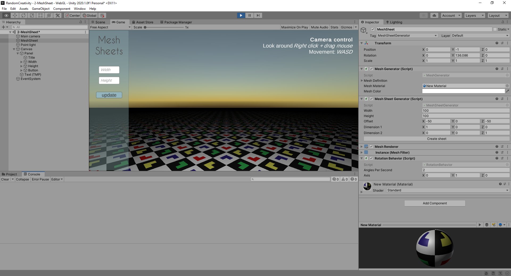

Mesh Sheets
===========

Now that it's possible to draw a single triangle, let's see how easily it scales to _more_ triangles. 

The goal is to create a simple mesh sheet of x by y quads. This turned out to be trivial. Just set up a MeshDefinition the "right" way hand it over to the MeshGenerator and Bob is someone's uncle. The "right" way in this case means:

* Create some Vertices
* Setup the UVs
* Define the triangles in a clock wise order (ie defining what vertices make up a triangle)

And when I say trivial, there is some minor number crunching to be done but nothing shocking. Adding some parameterization to account for offset and the quad dimensions in which a sheet has to be build, the code comes down to:

```csharp
    private static void CreateSheet(int width, int height, Vector3 dimension1, Vector3 dimension2, Vector3 offset , MeshGenerator generator)
    {
        var vertCount = (width + 1) * (height + 1);
        var triangleCount = width * height * 2 * 3;

        var definition = new MeshDefinition(vertCount, triangleCount);

        CreateVertices(definition, width, height, dimension1, dimension2, offset);
        CreateTriangles(definition, width, height);

        generator._meshDefinition = definition;

        generator.CreateMesh();
    }

    private static void CreateVertices(MeshDefinition definition, int width, int height, Vector3 dimension1, Vector3 dimension2, Vector3 offset)
    {
        for (int y = 0; y <= height; y++)
        {
            for (int x = 0; x <= width; x++)
            {
                var index = x + y * (width + 1);

                definition._vertices[index] = dimension1 * x + dimension2 * y + offset;
                definition._uv[index] = new Vector2(dimension1.normalized.magnitude * x, dimension2.normalized.magnitude * y);
            }
        }
    }

    private static void CreateTriangles(MeshDefinition definition, int width, int height )
    {
        var quadPoints1 = new int[] { 0, width + 2, 1 };
        var quadPoints2 = new int[] { 0, width + 1, width + 2 };

        for (int y = 0; y < height; y++)
        {
            for (int x = 0; x < width; x++)
            {
                var quad = (x + y * width);
                var offset = quad * 6;

                for (int p = 0; p < triangleLength; p++)
                {
                    var index = offset + p;

                    definition._triangles[index] = (x + y * (width + 1)) + quadPoints1[p];
                    definition._triangles[index + triangleLength] = (x + y * (width + 1)) + quadPoints2[p];
                }
            }
        }
    }
```

The end result is a sheet stretching as long and far as the eye can see as it is within the [Unity vertex limits](https://docs.unity3d.com/ScriptReference/Mesh-indexFormat.html) (65536).


<center>
    
</center>

The [demo can be found here](Html/MeshSheet/index.html).

Another interesting finding, which is completely unrelated, 

https://blogs.unity3d.com/2014/05/16/custom-operator-should-we-keep-it/