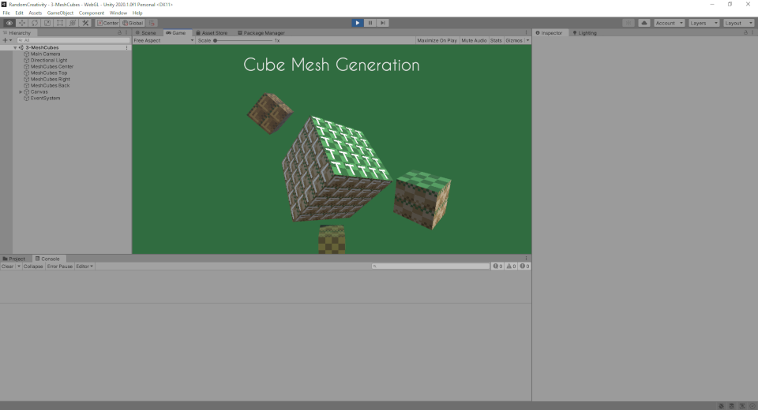

Creating Cubes
==============

### [Demo](Html/CubeMeshes/index.html)

The natural progression after creating a sheet, is to create cubes. The [MeshCubeGenerator](https://github.com/pointlesspun/Randomized-Creativity/blob/master/Assets/Scripts/Mesh/MeshCubeGenerator.cs) (MCB) does just that. The basic steps in the MCB are:

* Create a [MeshDefinition](https://github.com/pointlesspun/Randomized-Creativity/blob/master/Assets/Scripts/Mesh/MeshDefinition.cs).
* Allocate space for the [vertices](https://github.com/pointlesspun/Randomized-Creativity/blob/6b17149f3ae9968762d7980beb166b5898d08c06/Assets/Scripts/Mesh/MeshCubeGenerator.cs#L99), 
* Setup the [vertices and uvs in the MeshDefinition](https://github.com/pointlesspun/Randomized-Creativity/blob/6b17149f3ae9968762d7980beb166b5898d08c06/Assets/Scripts/Mesh/MeshCubeGenerator.cs#L117-L212)
* Define the [triangles in the MeshDefinition](https://github.com/pointlesspun/Randomized-Creativity/blob/6b17149f3ae9968762d7980beb166b5898d08c06/Assets/Scripts/Mesh/MeshCubeGenerator.cs#L214-L235)
* [Invoke the MeshGenerator with the MeshDefinition](https://github.com/pointlesspun/Randomized-Creativity/blob/6b17149f3ae9968762d7980beb166b5898d08c06/Assets/Scripts/Mesh/MeshCubeGenerator.cs#L104-L106)

First of all, the code makes several (hard-coded) assumptions about the setup of the vertices, uvs and triangles. For the scope of this section this is intentional
but can changed easily. 

The vertices are duplicated. Normally a cube can modelled with eight vertices, however if we want have unique UVs for each side of the cube we'll need to duplicate some of these vertices (for [reasons](https://answers.unity.com/questions/143109/why-does-a-primitive-cube-contain-24-verts.html?_ga=2.37175653.496666226.1595689598-278295550.1595427516)). 

The downside is that the size of Mesh is much more limited, the upside is... we can use textures.  

The MeshDefinition now contains a color and texture which can be assigned to the material in the MeshGenerator. The assumption made here is that it will be assigned to the default Texture of the default material, known to Unity as "_MainTex". The name of this texture can be set in the MeshGenerator.

The implementation is pretty inefficient, all sides of all cubes are being drawn, even though they are not always visible.   

Apart from the number mangling of the vertices and triangles, the code should be pretty straightforward.

The end result should look something like this:

    

## Scope Creep

Possible next steps:

* Draw a voxel shape from data rather than just fill a matrix of cubes.
* Improve performance.
* Deform the matrix using forces. 

---

## Credits
Top cover By Pablo Picasso - [1], PD-US, https://en.wikipedia.org/w/index.php?curid=38779722